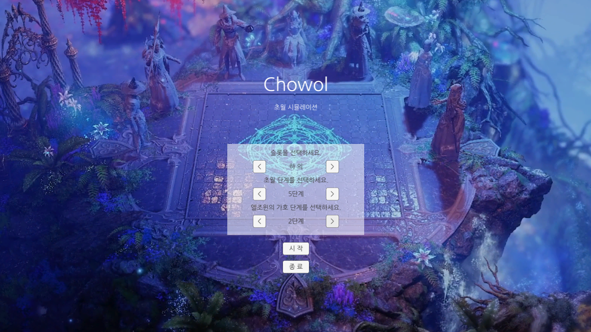

🇰🇷 한국어 | 🇺🇸 [English](README.md)

  <h2>🎮Chowol v1.1.1</h2>
  

---

## 📌 목차  

- [개요](#개요)  
- [게임 소개](#게임-소개)  
- [게임 특징](#게임-특징)  
- [조작법](#조작법)  
- [스크린샷 및 플레이 영상](#스크린샷-및-플레이-영상)  
- [사용 기술 스택](#사용-기술-스택)  
- [플레이](#플레이)
- [출처](#출처)
  
---

## 🧩 개요

- **프로젝트명**: Chowol (초월)  
- **개발 기간**: 2024.08 ~ 2024.10  
- **사용 엔진**: Unity6  
- **개발 언어**: C#  
- **팀 구성**: 개인 프로젝트

---

## 🕹️ 게임 소개

**Chowol**은 MMORPG **Lost Ark**의 **초월 시스템**을 기반으로 만든 퍼즐 시뮬레이션 게임입니다.  
플레이어는 장비 부위와 초월 단계를 선택하고 카드와 특수 타일을 활용해 모든 타일을 파괴하는 전략 퍼즐을 플레이합니다.
 

---

## ⭐ 게임 특징

| 특징 | 설명 |
|------|------|
| 🧩 타일 기반 퍼즐 시스템 | 타일 보드에서 카드 효과를 활용해 타일을 파괴하며 진행하는 전략 퍼즐 게임. |
| 🃏 카드 전략 시스템 | 다양한 카드 타입과 랭크에 따라 타일 파괴 범위와 효과가 달라지는 전략적 플레이. |
| ✨ 특수 타일 효과 | 특정 타일은 추가 효과를 발동하여 카드 강화, 카드 복제 등 게임 흐름을 변화시킴. |
| 🎯 확률 기반 게임 진행 | 카드 효과와 타일 파괴 확률이 적용되어 매 플레이마다 다른 결과 발생. |

---

## 🎮 조작법

| 동작 | 키 |
|------|----|
| 카드 선택 | 카드 클릭 |
| 타일 파괴 | 카드 선택 후 타일 클릭 |
| 카드 변경 | 정령 교체 버튼 클릭 |

---

## 🖼️ 스크린샷 및 ▶️ 플레이 영상

### 스크린샷
|  |
|:--:|
| 인게임 플레이 |

### 플레이 영상

> ✨ https://youtu.be/3viG7SOVsHE

---

## 🛠️ 사용 기술 스택

- **Unity Engine**: 타일 기반 퍼즐 게임 플레이 구현, Scene 관리
- **Unity UI / Event System**: 카드 UI 및 타일 상호작용 처리
- **Unity Audio System**: 이벤트 기반 사운드 재생
- **C#**: GameManager 중심 게임 상태 관리, 카드 시스템, 타일 로직 구현
- **자료구조**: Array, List, Dictionary, HashSet, Enum, LINQ 활용
- **Design Pattern**: Singleton 패턴 기반 전역 데이터 관리
- **Git**: 버전 관리

---

## 🚀 플레이

### A. 웹에서 플레이

> 🌐 https://play.unity.com/en/games/c2503f76-7bea-4074-9cb0-279078fc6f5f/chowol

---

## 📚 출처  
**<시스템>**
- 이 프로젝트는 MMORPG 게임 "로스트 아크"의 "초월 시스템"을 참고하여 개발되었습니다.

**<사운드>**
- smilegate RPG
- https://gongu.copyright.or.kr/gongu/wrt/wrt/view.do?wrtSn=13252439&menuNo=200020
---

감사합니다!  
즐거운 플레이 되세요 🎮

