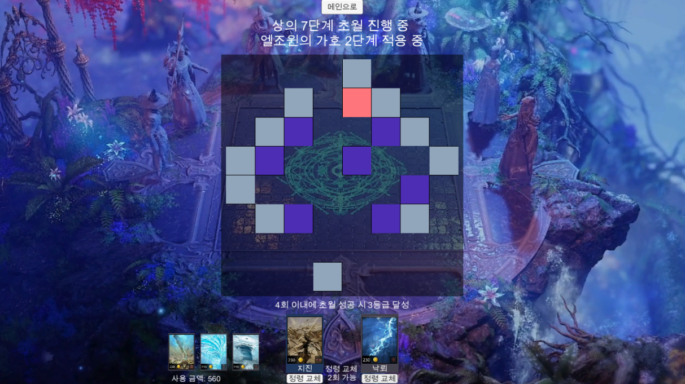

🇰🇷 한국어 | 🇺🇸 [English](README.md)

  <h2>🎮Drag&Slash Survivor v1.1.2</h2>
  

---

## 📌 목차  

- [개요](#개요)  
- [게임 소개](#게임-소개)  
- [게임 특징](#게임-특징)  
- [조작법](#조작법)  
- [스크린샷 및 플레이 영상](#스크린샷-및-플레이-영상)  
- [사용 기술 스택](#사용-기술-스택)  
- [플레이](#플레이)
- [제작자](#제작자)  
- [출처](#출처)
  
---

## 🧩 개요

- **프로젝트명**: Chowol (초월)  
- **개발 기간**: 2024.08 ~ 2024.10  
- **사용 엔진**: Unity6  
- **개발 언어**: C#  
- **팀 구성**: 개인 프로젝트

---

## 🕹️ 게임 소개

 **Chowol**은 MMORPG 게임 **로스트 아크**의 **초월** 시스템을 유니티로 구현한 시뮬레이션 모작입니다.

---

## ⭐ 게임 특징

| 특징 | 설명 |
|------|------|
| 👆 손가락이 곧 공격 | 손가락이 무기가 된다! 플레이어는 직접 무기를 드래그하여 대량의 적들을 공격하며 전장을 쓸어버리는 쾌감 제공. |
| ⚔️ 다양한 스킬 시스템 | 플레이어 스타일에 맞는 플레이! 다수의 스킬과 무기의 고유 특성을 활용함으로 공격 혹은 방어 위주로 선택하는 전략 시스템. |
| 🕹️ 짧은 플레이타임 | 캐주얼이라는 테마에 맞는 2분~3분의 플레이타임. |

---

## 🎮 조작법

| 동작 | 키 |
|------|----|
| 이동 | 터치 |
| 공격 | 터치 & 드래그 |

---

## 🖼️ 스크린샷 및 ▶️ 플레이 영상

### 스크린샷

|  |  |  |
|:--:|:--:|:--:|
| 인게임 전투 | 스킬 선택 | 보스 전투 |

### 플레이 영상

> ✨ https://youtu.be/3viG7SOVsHE

---

## 🛠️ 사용 기술 스택

- **Unity Engine**: 타일 기반 퍼즐 게임 플레이 구현, Scene 관리

- **Unity UI / Event System**: 카드 UI 및 타일 상호작용 처리

- **Unity Audio System**: 이벤트 기반 사운드 재생

- **C#**: GameManager 중심 게임 상태 관리, 카드 시스템, 타일 로직 구현

- **자료구조**: Array, List, Dictionary, HashSet, Enum, LINQ 활용

- **Design Pattern**: Singleton 패턴 기반 전역 데이터 관리

- **Git**: 버전 관리

---

## 🚀 플레이

### A. 웹에서 플레이

> 🌐 https://play.unity.com/en/games/c2503f76-7bea-4074-9cb0-279078fc6f5f/chowol

---

## 🙌 제작자

- 기획: **Man Jun Han**, **Minseok Seo**
- 개발: **CheonHyeok Moon**
- 팀명: **Team Funity**

---

## 📚 출처  
<시스템>
- 이 프로젝트는 MMORPG 게임 "로스트 아크"의 "초월 시스템"을 참고하여 개발되었습니다.

<사운드>
- smilegate RPG
- https://gongu.copyright.or.kr/gongu/wrt/wrt/view.do?wrtSn=13252439&menuNo=200020
---

감사합니다!  
즐거운 플레이 되세요 🎮

